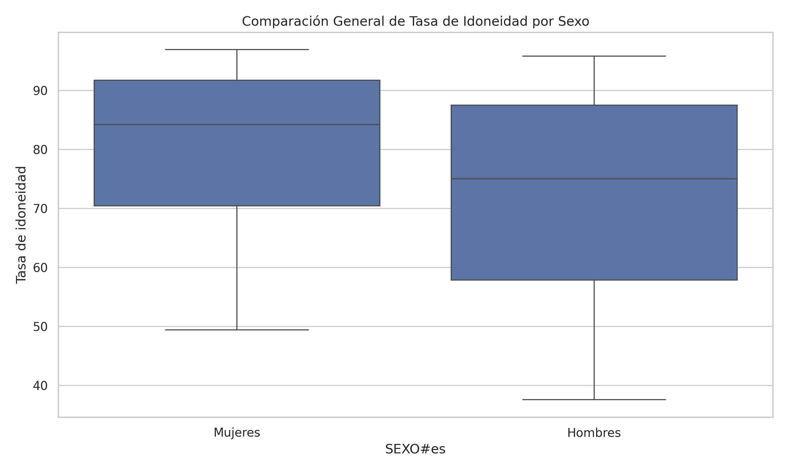
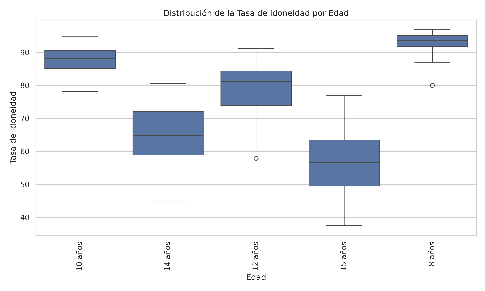
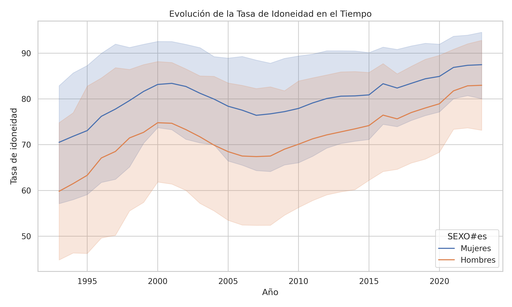
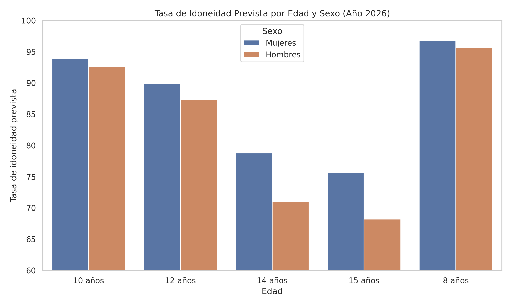
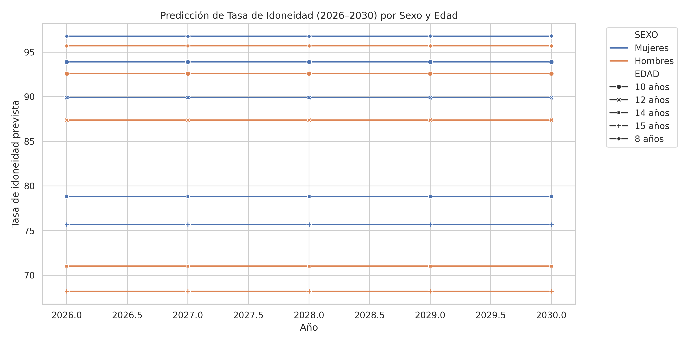
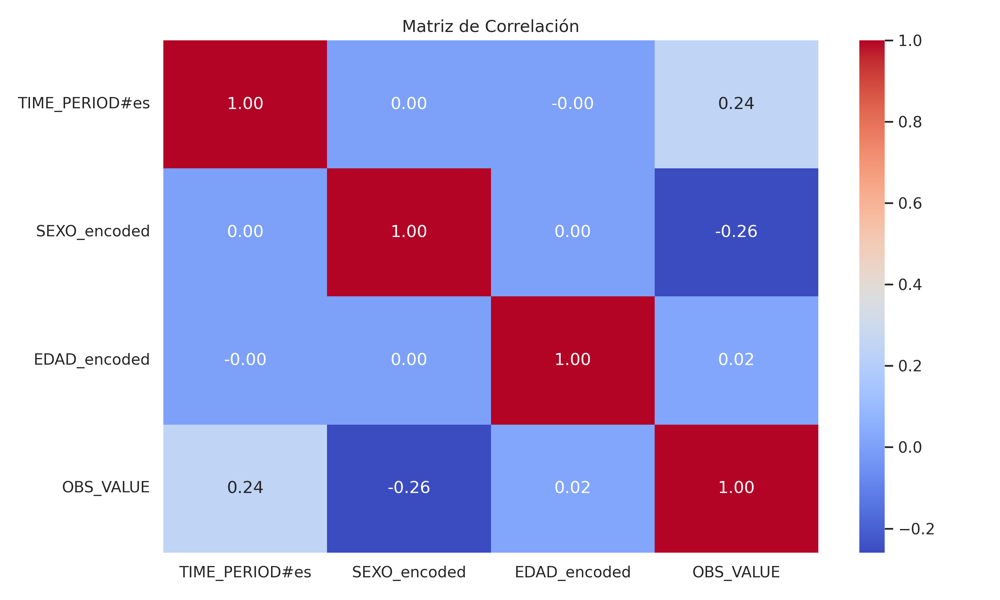

# Predicción de la Tasa de Idoneidad Escolar – Canarias (2026–2030)

Este proyecto aplica técnicas de análisis exploratorio de datos y modelos de machine learning para **predecir la tasa de idoneidad educativa** en edades de escolarización obligatoria, diferenciando por **sexo y edad**, usando datos históricos de Canarias.

> La tasa de idoneidad mide si los estudiantes están en el curso correspondiente a su edad (es decir, si no han repetido).

---

## Objetivos

- Analizar la evolución histórica de la tasa de idoneidad por edad y sexo.
- Detectar diferencias sistemáticas y puntos críticos.
- Entrenar modelos predictivos (Random Forest y XGBoost).
- Proyectar la tasa de idoneidad entre 2026 y 2030.
- Generar visualizaciones claras para comunicar los resultados.

---

## Tecnologías utilizadas

- Python 3  
- Pandas, NumPy  
- Seaborn, Matplotlib  
- Scikit-learn  
- XGBoost  
- Google Colab / Jupyter Notebook  

---

## Estructura del proyecto

| Archivo | Descripción |
|--------|-------------|
| `Tasa_de_Idoneidad_Canarias.ipynb` | Notebook completo con EDA, modelos y visualizaciones |
| `datasets-ISTAC_E41001A_000019_1.0_20250602135544.csv` | Datos históricos de Canarias |
| `predicciones_tasa_idoneidad_2026_2030.csv` | Predicciones generadas por XGBoost |
| `grafico_barras_2026.png` | Predicción 2026 por edad y sexo |
| `grafico_lineas_2026_2030.png` | Proyección 2026–2030 por edad y sexo |
| `boxplot_comparacion_sexo.png` | Distribución histórica por sexo |
| `boxplot_tasa_idoneidad_por_edad.png` | Distribución histórica por edad |
| `lineplot_evolucion_tasa_sexo.png` | Evolución histórica (1990–2023) |
| `heatmap_correlacion_tasa.png` | Mapa de correlación |

---

## Resultados del modelo

El algoritmo **XGBoost** logró un desempeño excelente:

-  **MSE:** 2.89  
-  **R²:** 0.985  
-  **MAE:** 1.15  

Esto indica que el modelo predice con alta precisión la tasa de idoneidad considerando edad, sexo y año.

---

## Visualizaciones

### Tasa por sexo (histórico)


---

### Distribución por edad (histórico)


---

### Evolución histórica (1990–2023)


---

### Predicción 2026 por sexo y edad


---

### Proyección 2026–2030


---

### Correlación de variables


---

##  Conclusiones y toma de decisiones

-  **A mayor edad, menor tasa de idoneidad**: Las edades críticas son 14 y 15 años.
-  **Las niñas muestran sistemáticamente mejores tasas** que los niños.
-  La evolución histórica sugiere una mejora general en la tasa, pero persisten desigualdades estructurales.
-  XGBoost permite proyecciones fiables hasta 2030, útil para la planificación educativa.

---

## Cómo usar

1. Clona este repositorio:
```bash
git clone https://github.com/tu_usuario/prediccion-tasa-idoneidad-canarias.git


**AUTOR**
Jonás De Martín Rodríguez
Mail: jonasdemartin@gmail.com
