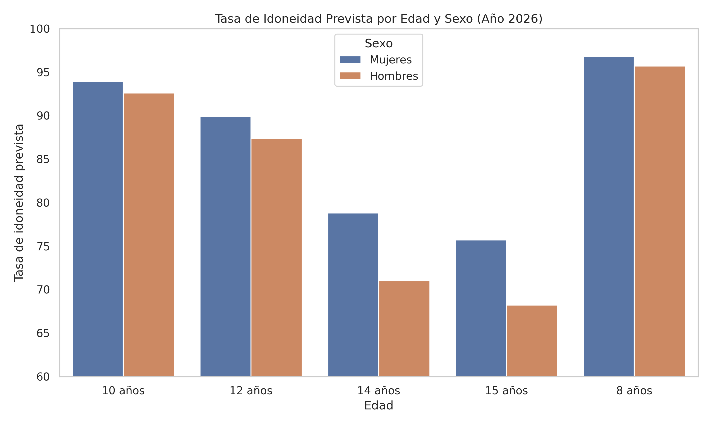

# Predicción de la Tasa de Idoneidad Escolar – Canarias (2026–2030)

Este proyecto aplica técnicas de análisis exploratorio de datos y modelos de machine learning para **predecir la tasa de idoneidad educativa** en edades de escolarización obligatoria, diferenciando por **sexo y edad**, usando datos históricos de Canarias.

> La tasa de idoneidad mide si los estudiantes están en el curso correspondiente a su edad (es decir, si no han repetido).

---

## Objetivos

- Analizar la evolución histórica de la tasa de idoneidad por edad y sexo.
- Detectar diferencias sistemáticas y puntos críticos.
- Entrenar modelos predictivos (Random Forest y XGBoost).
- Proyectar la tasa de idoneidad entre 2026 y 2030.
- Generar visualizaciones claras para comunicar los resultados.

---

# Tecnologías utilizadas

- Python 3
- Pandas, NumPy
- Seaborn, Matplotlib
- Scikit-learn
- XGBoost
- Google Colab / Jupyter Notebook

---

## Estructura del proyecto

| Archivo | Descripción |
|--------|-------------|
| `prediccion_tasa_idoneidad.ipynb` | Notebook con EDA, modelos y visualizaciones |
| `predicciones_tasa_idoneidad_2026_2030.csv` | Predicciones por edad y sexo entre 2026–2030 |
| `requirements.txt` | Librerías necesarias para reproducir el análisis |
| `img/grafico_barras_2026.png` | Visualización destacada por edad y sexo |
| `grafico_lineas_2026_2030.png` | Evolución de predicción por edad y sexo (línea) |
| `modelo_xgboost.pkl` *(opcional)* | Modelo XGBoost entrenado para reutilización |

---

## Resultados

El modelo **XGBoost** logró un rendimiento sobresaliente:

- 📉 **MSE:** 2.89  
- 📈 **R²:** 0.985

Esto indica que el modelo predice con gran precisión la tasa de idoneidad a partir del año, sexo y edad.

---

### Visualización destacada



*Las niñas presentan sistemáticamente mejores tasas que los niños. La tasa cae especialmente a los 14–15 años.*

---

## Conclusiones clave

- A mayor edad, menor tasa de idoneidad → **14 y 15 años son edades críticas.**
- Diferencias por sexo son persistentes: las **niñas mantienen mejores tasas.**
- XGBoost permite proyecciones robustas hasta 2030 con los datos disponibles.

---

## Cómo usar

1. Clona este repositorio:
```bash
git clone https://github.com/tu_usuario/educational-fit-prediction.git

**AUTOR**
Jonás De Martín Rodríguez
Mail: jonasdemartin@gmail.com
